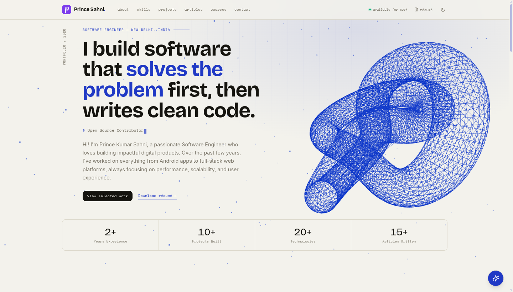

  
  <h1>Prince Kumar Sahni — Portfolio</h1>
  
Software Engineer · New Delhi, India · <a href="https://princesahni.com">princesahni.com</a>

Hi, I'm **Prince Kumar Sahni** — a Software Engineer who builds performant,
scalable products, from Android apps to full-stack web platforms.

This is my personal portfolio website — my work, experience, and ideas in one place.

## Highlights

- 🎨 Light & dark theme with a custom design system
- 🌀 Interactive 3D hero
- ✨ Smooth animations and scroll reveals
- 🤖 AI assistant that answers questions about my work
- ⚡ Fast, code-split, and fully responsive

## What's inside

- **Work** — selected projects I'm proud of
- **Experience** — where I've worked and what I shipped
- **Skills** — the stack I build with
- **Writing** — my articles on engineering and the web
- **Courses** — the things I teach
- **About** — a bit more about me, beyond the code
- **Contact** — the easiest way to reach me

## Built with

React · TypeScript · Vite · Tailwind CSS · Framer Motion · React Three Fiber · TanStack Query

## Find me

[Website](https://princesahni.com) · [GitHub](https://github.com/mrprince123) · [LinkedIn](https://www.linkedin.com/in/mrprince123/) · [Medium](https://medium.com/@mrprince123)

---

  Designed & built by Prince Kumar Sahni.

